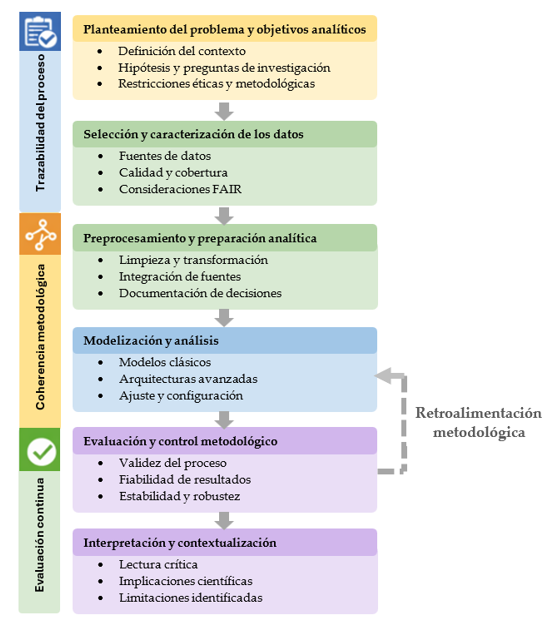

[](https://creativecommons.org/licenses/by/4.0/)
[](https://quarto.org/)
[](https://jcaceres-academic.github.io/urban-pm25-methodology/)
[](https://github.com/jcaceres-academic/urban-pm25-methodology)

---

## 🔗 **Direct access**
- 🧪 [Methodological scripts and pipeline implementation](scripts.html)
- 💻 [Reproducible notebook](notebook.html)
- 📄 [Associated article]()


## 🧠 Overview

This repository hosts the open, reproducible materials developed as a **methodological extension of a doctoral thesis in Applied Data Science**, focused on the analysis of urban PM2.5 concentrations.

Rather than proposing a single optimal predictive model, the project introduces a **coherent analytical pipeline** designed for real-world environmental data, where temporal structure, interpretability, and reproducibility are prioritised over algorithmic benchmarking.

The project is presented as an example of **research continuity**, illustrating how a doctoral research line can evolve beyond the thesis itself.

---

## 🎯 Research motivation

Urban air quality analysis is often approached through fragmented workflows, ad hoc modelling decisions, or performance-driven comparisons that overlook methodological coherence.

This project responds to several recurrent limitations observed in applied data science practice:

- Insufficient attention to the temporal structure of environmental data.
- Overemphasis on predictive performance at the expense of interpretability.
- Superficial adoption of emerging technologies without methodological grounding.
- Limited reproducibility in applied environmental analytics.

The proposed pipeline addresses these issues by prioritising **analytical clarity, transparency, and methodological robustness**.

---

## 🧩 Reproducible methodological workflow

The analytical workflow follows a structured and sequential pipeline:

1. **Data preparation and harmonisation**  
   Validation of raw observations, temporal parsing, and explicit handling of missing values.

2. **Exploratory and structural analysis**  
   Examination of temporal dynamics, seasonal behaviour, and data gaps to understand the data-generating process.

3. **Classical modelling and evaluation**  
   Simple baseline and linear models with time-based validation to establish methodological reference points.

4. **Quantum methodological extension**  
   Integration of a quantum kernel-based model under NISQ constraints, without claims of performance superiority.

This workflow reflects a **methodological stance**, not a technology-driven comparison.

---

## 🧭 Analytical philosophy

The pipeline is guided by the following principles:

- **Sequential structure**: each analytical step builds explicitly on the previous one.
- **Time-aware validation**: no random splits are applied to temporal data.
- **Model parsimony**: simple and interpretable models are favoured where appropriate.
- **Reproducibility by design**: all results are generated programmatically from documented scripts.
- **Extensibility**: emerging analytical paradigms can be integrated without structural changes.

This philosophy underpins both the doctoral thesis and its extension presented here.

---

## 🗂️ Repository structure

```text
urban-pm25-methodology/
├── docs/                      # Rendered Quarto website (GitHub Pages)
│   ├── index.html
│   ├── scripts.html
│   └── notebook.html
├── data/                      # Clean analysis-ready dataset
├── figures_tiff/              # High-resolution figures for publication
├── scripts/                   # R and Python scripts implementing the pipeline
├── index.qmd
├── scripts.qmd
├── notebook.qmd
├── _quarto.yml
├── LICENSE
└── README.md
```

## ⚙️ Technologies Used

| Category        | Tools / Packages |
|-----------------|------------------|
| **Programming** | [R](https://www.r-project.org/) 4.4 +  · [Quarto](https://quarto.org/) |
| **Data Handling** | `tidyverse` · `arrow` · `lubridate` . `readr`|
| **Visualisation** | `ggplot2` · `cowplot` |
| **Modelling** | `Linear models` · `Persistence baselines` |
| **Quantum Computing** | `Qiskit` · `Qiskit Aer` · `Qiskit Machine Learning` |
| **Reproducibility** | `Git` · `GitHub Pages` · `Conda` |

## 🔁 Reproducibility and openness

All analyses are fully reproducible and rely exclusively on open-source tools.

  - Scripts are executed sequentially and independently.
  - No manual data manipulation is performed.
  - Computational environments are explicitly documented.
  - Results are generated programmatically from source code.
  
This approach supports transparent, verifiable, and reusable research practices.

```{r fig1-pipeline, echo=FALSE, fig.align='center', out.width='90%'}

```

**Fig. 1.** Methodological pipeline for urban PM2.5 analysis, illustrating the sequential integration of data preparation, exploratory analysis, classical modelling, and a demonstrative quantum extension under NISQ constraints.

## 🎓 Relation to the doctoral thesis

This project constitutes a direct methodological extension of the doctoral thesis and is presented as evidence that the research line remains active, adaptable, and open to emerging analytical methodologies.

It is not intended as a standalone technological breakthrough, but as a **coherent continuation of a broader research programme** in applied data science and urban environmental analytics.

## 📚 Bibliographic Resources

Bibliographic resources associated with the doctoral thesis and related publications will be made available in this repository.

## 📚 Citation

If you reuse or adapt this resource, please cite as:

> Cáceres-Tello, J., & Galán-Hernández, J. J. (2025).  
Urban PM2.5 Methodology: A reproducible analytical pipeline for applied data science.
Available at: [https://jcaceres-academic.github.io/urban-pm25-methodology/](https://jcaceres-academic.github.io/urban-pm25-methodology) 

## ⚖️ License 

Code and notebooks: Creative Commons Attribution 4.0 (CC BY 4.0)
Data (if reused): CC0 1.0 Public Domain Dedication


## 📬 Contact

Jesús Cáceres Tello
Department of Computer Systems and Computing
Universidad Complutense de Madrid

📧 [jcaceres.academic@gmail.com](mailto:jcaceres.academic@gmail.com)  
📧 [jescacer@ucm.es](mailto:jescacer@ucm.es)

⬅️ [Back to my main page](https://jcaceres-academic.github.io)

This repository supports open, transparent, and reproducible research in environmental data science and STEM education.
