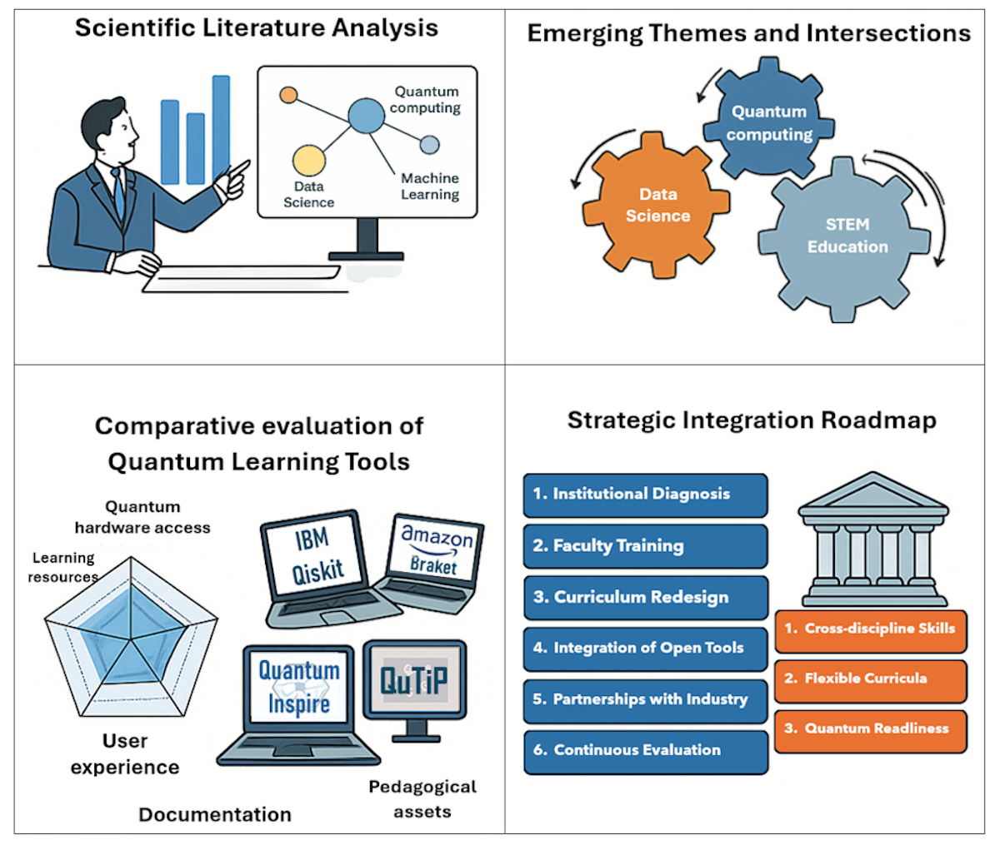
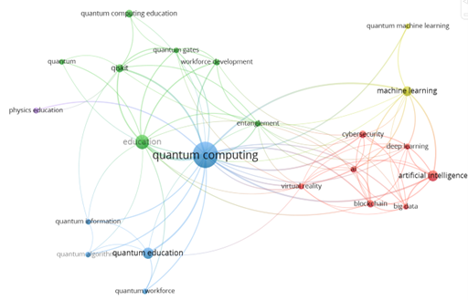
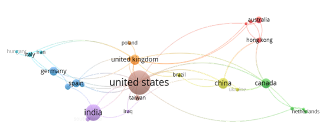
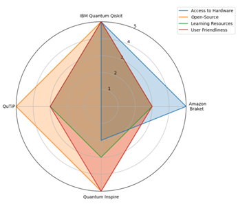
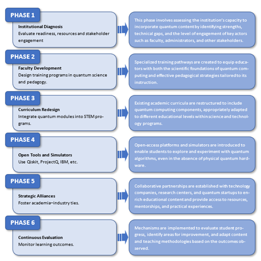

[](https://creativecommons.org/licenses/by/4.0/)
[](https://quarto.org/)
[](https://jcaceres-academic.github.io/quantum-computing-stem-education/)
[](https://github.com/jcaceres-academic/quantum-computing-stem-education)
[](https://doi.org/10.3390/computers14060235)


---

## 🔗 **Direct access**
- 🧪 [Bibliometric and pedagogical analysis scripts](scripts.html)
- 💻 [Reproducible notebook](notebook.html)
- 📄 [Associated article (Computers, 2025)](https://doi.org/10.3390/computers14060235)


# 🧠 Overview

Quantum computing is increasingly intersecting with data science and STEM education, yet its integration into higher education remains fragmented and uneven. This project presents a dual analytical approach that combines **bibliometric mapping of scientific production** with a **pedagogical analysis of widely used quantum education platforms**, aiming to clarify how quantum technologies are currently shaping educational and curricular practices.

Based on a curated corpus of peer-reviewed publications indexed in Scopus (2015–2024), the study identifies growth trends, thematic structures, and collaboration patterns at the intersection of quantum computing, data science, and education. In parallel, it evaluates representative quantum platforms using pedagogical criteria such as accessibility, usability, and curricular alignment.

The resulting evidence supports a set of **strategic insights** for curriculum design and institutional planning. Beyond mapping the field, the project establishes a **conceptual and methodological foundation** for subsequent applied and reproducible studies within a broader doctoral research programme, including extensible analytical pipelines and demonstrative quantum computing applications under NISQ constraints.




# 🎯 Research motivation

## Research Objectives and Scope

This project is guided by three main objectives:

1. **To map the evolution and thematic structure** of scientific production at the intersection of quantum computing, data science, and STEM education, identifying dominant research trends and emerging areas.

2. **To analyse pedagogical orientations and practical tools** used in quantum education, assessing their accessibility, usability, and alignment with higher education curricula.

3. **To derive strategic insights** that inform curriculum design, institutional planning, and future research directions in quantum-enabled STEM education.

The scope of the study is deliberately focused on **higher education and advanced STEM training**, combining quantitative bibliometric techniques with qualitative, criteria-based evaluation of educational platforms. The project does not aim to assess algorithmic performance or technological superiority, but rather to understand how quantum computing is being translated into educational practice and how this translation can be strengthened in a coherent and scalable manner.

## Methodological Framework

The study adopts a **dual methodological approach** that integrates bibliometric analysis with a structured pedagogical review of quantum education platforms. This design enables a coherent examination of both the **scientific knowledge base** and its **translation into educational practice**.

### Bibliometric analysis
A curated dataset of peer-reviewed publications indexed in Scopus (2015–2024) was constructed using a targeted search strategy. Records were filtered through a multi-stage curation process involving deduplication, relevance screening, and conceptual validation. Bibliometric techniques—such as co-occurrence analysis, thematic clustering, and collaboration network mapping—were applied to identify structural patterns and temporal dynamics in the field.

### Pedagogical tool analysis
In parallel, a selection of widely used quantum education platforms was analysed using **explicit pedagogical criteria**, including accessibility, usability, availability of educational resources, and curricular alignment. The analysis focuses on documented educational use rather than technical performance benchmarking.

### Analytical principles
Across both components, the methodology prioritises:
- transparency of analytical decisions,
- time-aware interpretation of trends,
- reproducibility through script-based workflows, and
- coherence between conceptual analysis and educational implications.

## Bibliometric and Thematic Results

The bibliometric analysis reveals a rapidly growing yet structurally fragmented research field at the intersection of quantum computing, data science, and STEM education. The results highlight dominant thematic areas, emerging pedagogical concerns, and the relative position of education-oriented contributions within a largely technology-driven landscape.

### Thematic structure and keyword networks



The keyword co-occurrence network shows a strong concentration around core technological concepts, with educational and curricular themes appearing as secondary but increasingly connected clusters.

### Collaboration and geographical patterns



The collaboration network indicates a predominance of geographically concentrated research activity, with limited cross-institutional continuity, reinforcing the fragmented nature of the field.

## Educational Tools Analysis

To complement the bibliometric findings, a comparative analysis of widely adopted quantum education platforms was conducted using pedagogical criteria focused on accessibility, usability, and curricular integration.



Rather than benchmarking technical performance, this analysis highlights how platform design choices influence their educational suitability and scalability in higher education contexts.

## Strategic Implications for STEM Education

The combined evidence from bibliometric trends and tool analysis supports a staged approach to the integration of quantum computing in STEM education.



## 🧩 Reproducible methodological workflow

The analytical workflow follows a structured and sequential pipeline:

1. **Data preparation and harmonisation**  
   Validation of raw observations, temporal parsing, and explicit handling of missing values.

2. **Exploratory and structural analysis**  
   Examination of temporal dynamics, seasonal behaviour, and data gaps to understand the data-generating process.

3. **Classical modelling and evaluation**  
   Simple baseline and linear models with time-based validation to establish methodological reference points.

4. **Quantum methodological extension**  
   Integration of a quantum kernel-based model under NISQ constraints, without claims of performance superiority.

This workflow reflects a **methodological stance**, not a technology-driven comparison.


## Relation to the Doctoral Thesis

This project constitutes the **conceptual and analytical foundation** of a broader doctoral research programme focused on applied data science, STEM education, and emerging computational paradigms. By systematically mapping scientific trends and analysing pedagogical tools, it establishes the theoretical and methodological context in which subsequent applied studies are situated.

Within the structure of the doctoral thesis, this work precedes and informs **reproducible applied research** that operationalises the identified methodological principles. In particular, the insights derived here directly support the design and validation of extensible analytical pipelines, including demonstrative applications of quantum computing under NISQ constraints in real-world data science contexts.

Rather than functioning as an isolated literature-based contribution, the project articulates a coherent research trajectory in which conceptual analysis, methodological design, and empirical validation are explicitly linked.


## Reproducibility and Access

All analyses presented in this project are designed to ensure **transparency, traceability, and reproducibility**. The complete analytical workflow is implemented through documented scripts and rendered using Quarto, allowing results to be regenerated and inspected in a structured manner.

- Bibliometric analyses and visualisations are generated programmatically from curated metadata.
- Pedagogical evaluations follow explicitly defined criteria and documented analytical steps.
- No manual data manipulation is performed outside scripted workflows.

Direct access to the underlying materials is provided through the links below:
- 🧪 **Analytical scripts**: implementation of bibliometric and pedagogical analyses.
- 💻 **Reproducible notebook**: step-by-step execution and figure generation.
- 📄 **Associated article**: peer-reviewed publication in *Computers* (2025).

Together, these resources support open, verifiable research practices and enable reuse and extension within related studies in data science, STEM education, and applied quantum computing.


## 🗂️ Repository structure

```text
quantum-computing-stem-education/
├── docs/ # Rendered Quarto website (GitHub Pages)
├── scripts/ # Bibliometric and pedagogical analysis scripts
├── figures/ # Reproducible figures and visual outputs
├── index.qmd
├── notebook.qmd
├── _quarto.yml
├── README.md
└── LICENSE
```

## ⚙️ Technologies Used

| Category | Tools |
|--------|------|
| Programming | R · Quarto |
| Data Sources | Scopus (bibliographic metadata) |
| Bibliometric Analysis | VOSviewer |
| Visualisation | ggplot2 |
| Reproducibility | Git · GitHub Pages |


## 🎓 Relation to the doctoral thesis

This project constitutes a direct methodological extension of the doctoral thesis and is presented as evidence that the research line remains active, adaptable, and open to emerging analytical methodologies.

It is not intended as a standalone technological breakthrough, but as a **coherent continuation of a broader research programme** in applied data science and urban environmental analytics.

## 📚 Bibliographic Resources

Bibliographic resources associated with the doctoral thesis and related publications will be made available in this repository.

## 📚 Citation

If you use or refer to this work, please cite the associated article:

Cáceres-Tello, J.; López-Meneses, E.; Galán-Hernández, J. J.; López-Catalán, L.  
**Quantum Computing in Data Science and STEM Education: Mapping Academic Trends and Analyzing Practical Tools.** *Computers* 2025, 14, 235. https://doi.org/10.3390/computers14060235

## ⚖️ License 

- Source code and notebooks: MIT License  
- Texts, figures, and analytical materials: Creative Commons Attribution 4.0 (CC BY 4.0)


## 📬 Contact

Jesús Cáceres Tello
Department of Computer Systems and Computing
Universidad Complutense de Madrid

📧 [jcaceres.academic@gmail.com](mailto:jcaceres.academic@gmail.com)  
📧 [jescacer@ucm.es](mailto:jescacer@ucm.es)

⬅️ [Back to my main page](https://jcaceres-academic.github.io)

This repository supports open, transparent, and reproducible research in **quantum computing, data science, and STEM education**.